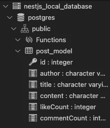
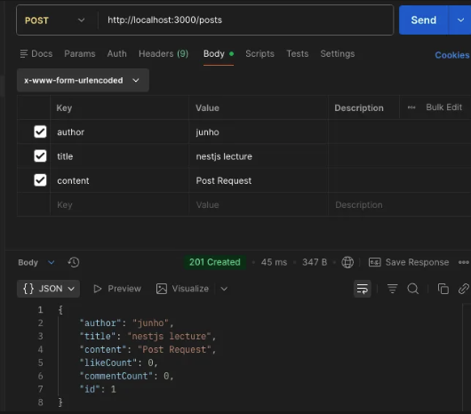
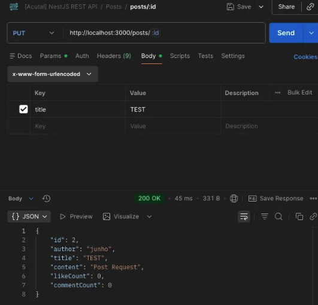

# Nest 기본

### 응답 설정 : `src/app.controller.ts`

컨트롤러 내부에서 @Get, @Post 등으로 먼저 지정한 뒤에 응답 함수를 작성한다.

```sql
  @Get('test') // 파라미터는 경로를 의미
  getHello() {
    return 'Home Page';
  }
```

```sql
import { Controller, Get } from '@nestjs/common';
import { AppService } from './app.service';

@Controller()
export class AppController {
  constructor(private readonly appService: AppService) {}

  @Get()
  getHello() {
    return 'Home Page';
  }

  @Get('post')
  getPost() {
    return 'Post Page';
  }

  @Get('user')
  getUser() {
    return 'User Page';
  }
}
```

### 요청 라이프 사이클

> 요청이 보내진 다음에 응답으로 돌아오는 것 까지의 과정
> 

Middleware, Guard, Interceptor, Pipe 는 필수 사항이 아니다.

하지만 요청 로직을 처리하는 부분인 Controller, Service, Repository는 필수사항이다.

그 후에 Exception Filter와 Interceptor을 거쳐서 응답이 반환된다.

### 응답 보내기

아래와 같은 경우 @Controller 에서 엔드 포인트인 a, @Get 에서 엔드 포인트인 b 를 설정해주었으므로 아래의 getPost 요청을 보내기 위해서는 domain/a/b 경로로 요청을 보내야 한다.

+) 실제로 프로젝트를 구현할 때는 app.controller.ts 에 이것들을 적지 않는다. interface 별로 모듈을 만들어서 구현한다.

```sql
@Controller('a')
export class AppController {
  constructor(private readonly appService: AppService) {}

  @Get('b')
  getPost(): Post {
    return {
      author: 'author',
      title: 'title',
      content: 'content',
      likeCount: 100000,
      commentCount: 100,
    };
  }
}
```

### 모듈 생성하기

Nest는 CLI를 통해 편리하고 빠르게 모듈을 생성할 수 있다.

```sql
$ nest g resource
$ 모듈 이름
$ REST API
$ No
```

## REST API

> GET 요청은 Query를 사용하고 나머지는 전부 Body를 사용한다.
> 
- [GET] http://localhost:3000/posts ⇒ 다수의 posts를 가져온다.
- [GET] http://localhost:3000/posts/11 ⇒ 11이라는 ID를 갖고 있는 post 하나를 가져온다.
- [POST] http://localhost:3000/posts ⇒ 새로운 post를 생성한다.
- [PATCH] http://localhost:3000/posts/8 ⇒ 8이라는 ID를 갖고 있는 post를 부분 변경한다. (변경하고 싶은 부분만 Body에 넣어준다.)
- [PUT] http://localhost:3000/posts/8 ⇒ 8이라는 ID를 갖고 있는 post를 변경하거나 생성한다. (없으면 생성하기 때문에 전체를 모두 Body에 넣어야 한다.)
- [DELETE] http://localhost:3000/posts/3 ⇒ 3이라는 ID를 갖고 있는 post를 삭제한다.

### 특정 ID에 대한 요청

특정 ID에 대한 요청인 경우에는 `/posts/:id` 이렇게 작성한다.

```sql
@Get(':id')
getPost(@Param('id') id : string){
  return posts.find((post:PostModel) => post.id === +id)
}
```

### Not Found (기본으로 제공되는 Exception 사용하면 된다.)

```sql
if(!post) {
  throw new NotFoundException(); 
}
```

### POST 구현

바디에서 입력받은 데이터들을 새 포스트로 입력해야 하므로 @Body 를 사용해서 변수로 만든다.

```tsx
@Post()
postPosts(
  @Body('author') author: string,
  @Body('title') title: string,
  @Body('content') content: string,
) {
  const post: PostModel = {
    id: posts[posts.length - 1].id + 1,
    author,
    title,
    content,
    likeCount: 0,
    commentCount: 0,
  };
  posts = [...posts, post];
  return post;
}
```

### PUT 구현

```tsx
@Put(':id')
putPost(
  @Param('id') id: string,
  @Body('author') author?: string,
  @Body('title') title?: string,
  @Body('content') content?: string,
) {
  const post = posts.find((post) => post.id == +id);
  if (!post) {
    throw new NotFoundException();
  }
  if (author) {
    post.author = author;
  }
  if (title) {
    post.title = title;
  }
  if (content) {
    post.content = content;
  }
  posts = posts.map((prevPost) => (prevPost.id === +id ? post : prevPost));
  return post;
 }
```

### DELETE 구현

```tsx
@Delete(':id')
deletePost(@Param('id') id: string) {
  const post = posts.find((post: PostModel) => post.id === +id);
  if (!post) {
    throw new NotFoundException();
  }
  posts = posts.filter((post) => post.id !== +id);
  return id;
}
```

## Service

지금까지는 모든 코드를 controller.ts 파일에 작성했다.

하지만 현재는 프로젝트가 커지고 코드가 많아지게 되면 굉장히 관리하기 힘든 구조이기 때문에 각 엔드포인트에 해당하는 코드들을 service.ts에 함수로 만들어 저장하고 이를 호출해서 사용하는 방식으로 코드를 변경해야 한다.

이때 중요한 것이 의존성 주입과 제어의 역전이다.

직접 PostsService 라는 클래스를 생성하지 않았는데 `constructor(private readonly postsService: PostsService) {}` 이 코드만으로 컨트롤러와 서비스를 연결하였다.

## 의존성

### 의존성 주입

아래와 같은 경우 A는 B가 존재할 때만 생성할 수 있으므로 의존하고 있다고 볼 수 있다.

즉, B는 A가 생성될 때 주입된다.

```tsx
class A {
	constructor(instance: B)
}

class B {
}
```

주입을 시켜야 하는 클래스들을 모두 module.ts 파일의 providers 안에 넣어주면 된다.

이때 클래스 자체를 넣는다. 괄호를 붙이면 인스턴스가 된다는 것에 주의해야 한다.

코드를 보면서 이해를 해보자.

`posts.controller.ts` 의 @Controller(’posts’) 아래에 보면 다음과 같은 코드가 자동으로 작성되어져있다.

> constructor(private readonly postsService: PostsService) {}
> 

이 코드가 바로 Nest에서 자동으로 의존성을 주입해주는 부분이다.

이제 `posts.moudle.ts`에 가보면 controllers와 porivders가 존재한다.

```tsx
// posts.moudle.ts

@Module({
  controllers: [PostsController],
  providers: [PostsService],
})
export class PostsModule {}
```

여기서 Nest가 자동으로 의존성을 주입해주는 것들을 providers 에 넣어주면 자동으로 연결이 되는 것이다.

이제 이 개념이 posts 폴더 뿐만 아니라 전체에 적용된다고 보면 된다.

최상단에 존재하는 `app.module.ts` 파일에서는 `imports` 키워드도 확인할 수 있는데, 이때 imports 부분에서 posts 모듈을 연결한다고 보면 된다.

```tsx
// app.module.ts

@Module({
	imports: [PostsModule],
  controllers: [PostsController],
  providers: [PostsService],
})
export class PostsModule {}
```

그리고 최종적으로 main.ts 파일에서 앱을 생성할 때 AppModule을 실행하게 된다.

```tsx
// main.ts

async function bootstrap() {
  const app = await NestFactory.create(AppModule);
  await app.listen(process.env.PORT ?? 3000);
}
```

## Docker

실행 : `$ docker-compose up`

## Typeorm

> 쉽게 테이블의 구조를 생성하기 위해서 사용함.
> 

### 생성 방법

1. 먼저 entity.ts 파일에 엔티티와 칼럼을 넣어주고 (PK 있어야 함 `PrimaryGeneratedColumn`)
2. app.module.ts 파일에 entities 에 새로 만든 클래스를 넣어준다.

```tsx
// src/posts/entities/posts.entity.ts

import { Column, Entity } from "typeorm";

@Entity()
export class PostModel {
  @PrimaryGeneratedColumn()
  id: number;

  @Column()
  author: string;

  @Column()
  title: string;

  @Column()
  content: string;

  @Column()
  likeCount: number;

  @Column()
  commentCount: number;
}

// src/app.module.ts
import { Module } from '@nestjs/common';
import { AppController } from './app.controller';
import { AppService } from './app.service';
import { PostsModule } from './posts/posts.module';
import { TypeOrmModule } from '@nestjs/typeorm';

@Module({
  imports: [
    PostsModule,
    TypeOrmModule.forRoot({
      type: 'postgres',
      host: '127.0.0.1',
      port: 5432,
      username: 'postgres',
      password: 'postgres',
      database: 'postgres',
      entities: [PostsModel],
      synchronize: true,
    })
  ],
  controllers: [AppController],
  providers: [AppService],
})
export class AppModule {}
```



이렇게 생성된 것을 확인할 수 있다.

이제 연결을 해주어야한다.

위에서 생성한 DB 테이블 클래스인 PostsModel을 NestJS와 연결하는 과정이다.

1. 이때 `posts.module.ts` 파일에서 `TypeOrmModule.forFeature` 코드를 사용하는 이유는 다음과 같다.

> "Nest야, 이 모듈(PostsModule)에서는 `PostsModel`이라는 설계도를 사용해서 DB에 접근할 거야. 그러니 이 모델을 관리할 수 있는 도구(Repository)를 준비해줘!"
> 
1. `posts.service.ts` 파일에서 Repository 주입하기

```tsx
// posts.module.ts

@Module({
  imports: [
    TypeOrmModule.forFeature([
      PostsModel,
    ])
  ],
  controllers: [PostsController],
  providers: [PostsService],
})
export class PostsModule {}

// posts.service.ts
@Injectable()
export class PostsService {
  constructor(
    @InjectRepository(PostsModel)
    private readonly postsRepository: Repository<PostModel>) {}
```

### GET

이제 getAllPosts 함수를 변경해보자.

```tsx
  async getAllPosts() {
    this.postsRepository.find();
  }
```

다음과 같이 Repository 를 사용하는데, 이때 find의 파라미터를 공백으로 넣으면 필터링을 거치지 않기 때문에 모든 데이터를 가져오게 된다.

다음은 getPostById 함수를 변경해보자.

MySQL 쿼리문처럼 조건을 찾기 위해서는 `where` 라는 키워드를 사용해야 한다.

`데이터 존재 값 : 비교 값` 형태로 코드를 작성해주면 된다.

(둘 다 변수명이 같을 경우에는 그냥 하나로 통합해서 써도 된다. id : id ⇒ id)

+) await 로 반환되기 때문에 Promise로 반환된다. 따라서 null이 아니기 때문에 에러가 잡히지 않는다. 이 부분을 주의해야한다.

```tsx
// 변경 전
  getPostById(id: number) {
    const post = posts.find((post: PostModel) => post.id === +id);

    if (!post) {
      throw new NotFoundException();
    }

    return post;
  }

// 변경 후
  async getPostById(id: number) {
    const post = await this.postsRepository.findOne({
      where: {
        id: id,
      },
    });

    if (!post) {
      throw new NotFoundException();
    }

    return post;
  }
```

### CREATE

- create 메서드 : 저장할 객체를 생성한다.
- save 메서드 : 객체를 저장한다. (create 메서드에서 생성한 객체로)

위에서 PostsModel 타입으로 데이터가 들어올 것이라고 선언해두었기 때문에 여기서는 바로 타입을 활용할 수 있게된다.

```tsx
  async createPost(author: string, title: string, content: string) {
    const post = this.postsRepository.create({
      author,
      title,
      content,
      likeCount: 0,
      commentCount: 0,
    });

    const newPost = await this.postsRepository.save(post);

    return newPost;
  }
```

이때 중요한 점은, 바로 id를 따로 입력하지 않았다는 점이다.

post 값으로 id를 입력하지 않은 채로 save를 했는데 postman을 확인해보면 id가 들어가있다.

자동으로 id가 생성이 된다는 것을 확인할 수 있었다.



이게 어떻게 가능한걸까?

바로 PK를 entity 선언 부분에서 따로 정해주었기 때문이다.

<aside>
✋

### 그렇다면 만약 1, 2, 3 id를 할당한 뒤에 id 2에 해당하는 데이터를 지우면 다음에 생성되는 id는 빈 곳을 채우는 2가 될까 아니면 4가 될까?

⇒ 결론부터 말하자면 다음에 새로 생성되는 데이터의 id는 4가 된다.

왜냐하면 데이터베이스는 기본적으로 한 번 사용된 번호는 다시 쓰지 않는 것을 원칙으로 하기 때문이다!

좀 더 자세히 알아보자면, Entity 부분에서 id를 설정할 때 `@PrimaryGeneratedColumn()` 데코레이터를 사용했을 것이다. 이때 데이터베이스 내부적으로는 카운터가 돌아가게 된다.

1번 id를 생성했으면 카운터는 2가 되고 다음 2번 id를 생성하면 카운터는 3이되는 방식으로 동작한다.

만약 2번 id를 가진 데이터를 삭제해도 id는 3번까지 사용 되었으므로 카운터는 여전히 4일것이다.

따라서 다음에 생성될 데이터는 현재 카운터 값인 4를 할당받게 된다.

### 그렇다면 중간중간 빈 자리가 있기 때문에 낭비되는 부분이 생길수도 있고 id가 계속해서 삭제되고 쌓이다보면 오버플로우 같은 현상이 일어나지는 않을까?

⇒ 보통 4바이트 정수형을 쓰면 21억 번까지 생성할 수 있기 때문에 ID가 커지는 것에 대해서는 걱정하지 않아도 된다.

그리고 비어있는 ID를 채우고 싶다면 DB의 시퀀스를 강제로 초기화 해야 하는데, 실무에서는 거의 하지 않는 굉장히 위험한 작업이라고 한다.

게다가 예전에 2번 사용자가 쓴 댓글이나 결제 내역이 DB 어딘가에 남아있다면, 새로 가입한 2번 사용자가 그 내역을 보게 될 위험이 있다는 데이터 무결성 문제도 존재한다.

또한, 새로운 ID를 생성할 때 매번 중간에 빈 번호가 있는지 확인하는 것은 굉장히 비효율적이기 때문에 그냥 마지막 번호에 +1을 하는 것이 훨씬 빠르다.

</aside>

### UPDATE

- SAVE
    - 만약 데이터가 존재하지 않는다면 새로 생성한다.
    - 만약 같은 id 값을 가진 데이터가 존재한다면 해당 데이터를 업데이트한다.

```tsx
  async updatePost(postId: number, author: string, title: string, content: string) {
    const post = await this.postsRepository.findOne({
      where: {
        id: postId,
      },
    });

    if (!post) {
      throw new NotFoundException();
    }

    if (author) {
      post.author = author;
    }

    if (title) {
      post.title = title;
    }

    if (content) {
      post.content = content;
    }

    const newPost = await this.postsRepository.save(post);

    return newPost;
  }
```



### DELETE

```tsx
  async deletePost(id: number) {
    const post = this.postsRepository.findOne({
      where: {
        id,
      },
    });

    if (!post) {
      throw new NotFoundException();
    }

    await this.postsRepository.delete(id);

    return id;
  }
```
